# NLP_IndiMusic
인공지능 소학회 활동 중 자연어처리 팀원들과 제작한 노래 가사 기반 장르 분류 프로젝트입니다.  
전체 프로젝트는 private이라 제가 담당한 '인디 장르 100곡 가사 크롤링'과 '감정 라벨링'만 새로 public 레포지토리로 개설한 점 참고 부탁드립니다.  
구글 코랩에서 작성되었고, 코드와 발표 자료는 리드미 또는 하단 구글 드라이브 링크 참고 부탁드립니다.
https://drive.google.com/drive/folders/1yM3_ctEGVeWAu7O3PK2qrnij6-DLXa8C?usp=sharing  
감사합니다.  

# 최종 프로젝트 발표 자료
  
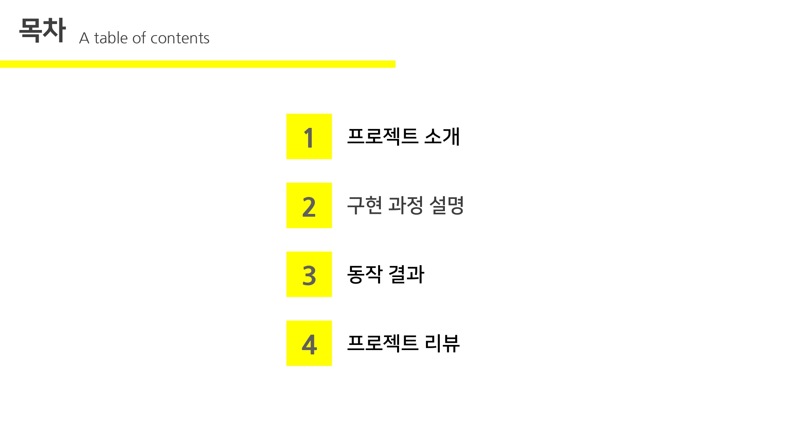  
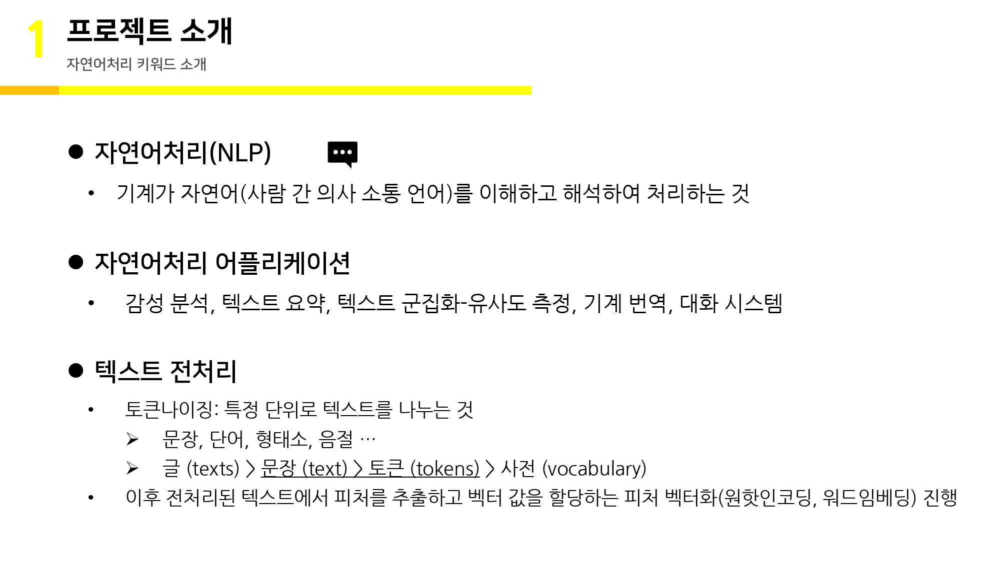  
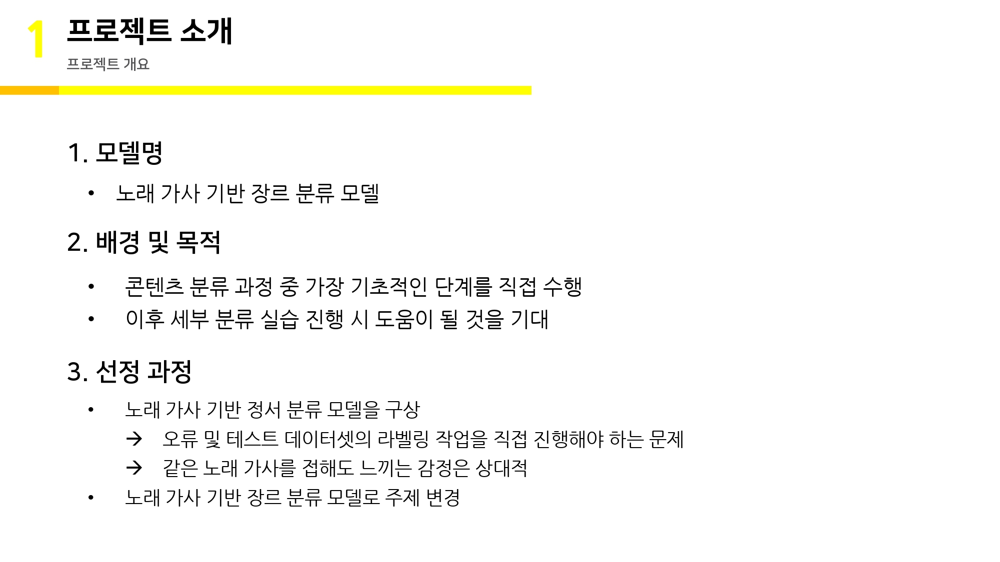  
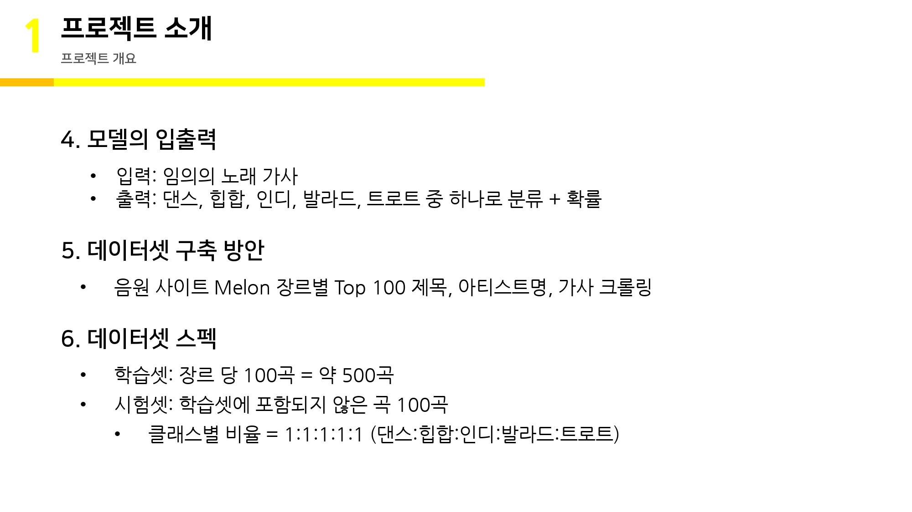  
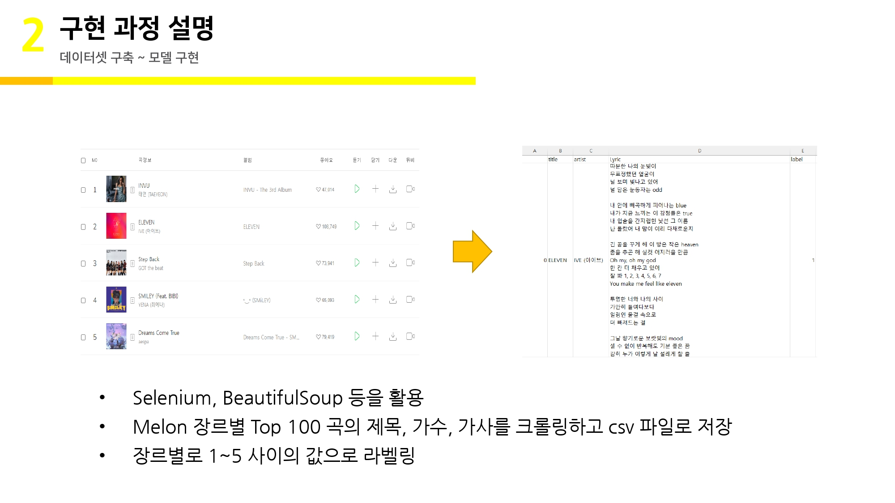  
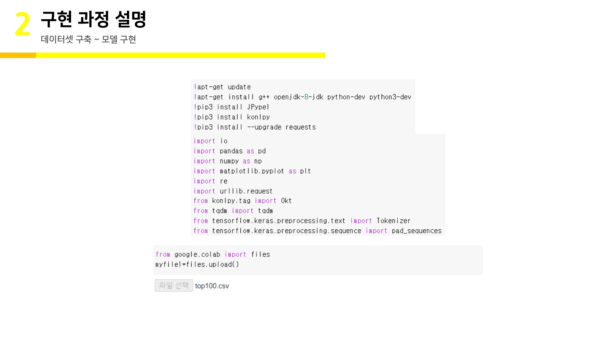  
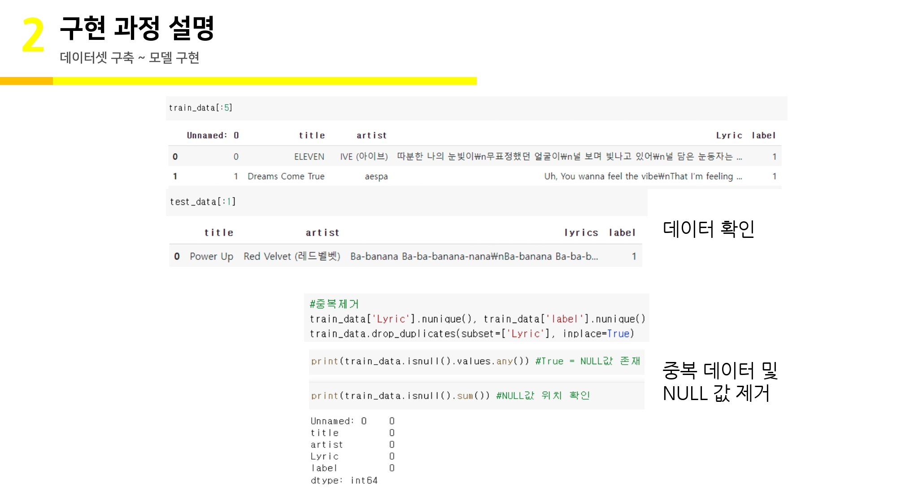  
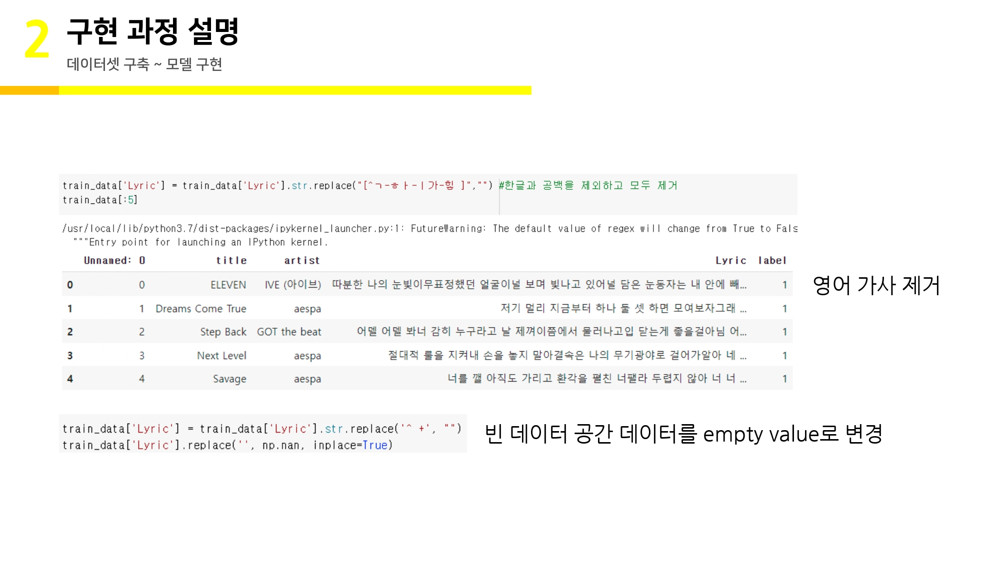  
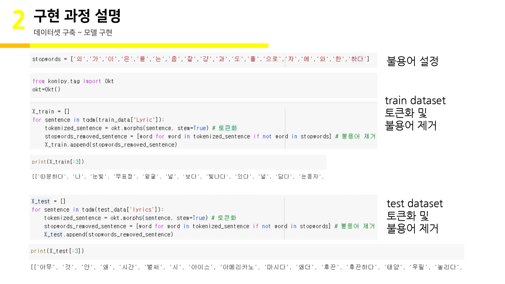  
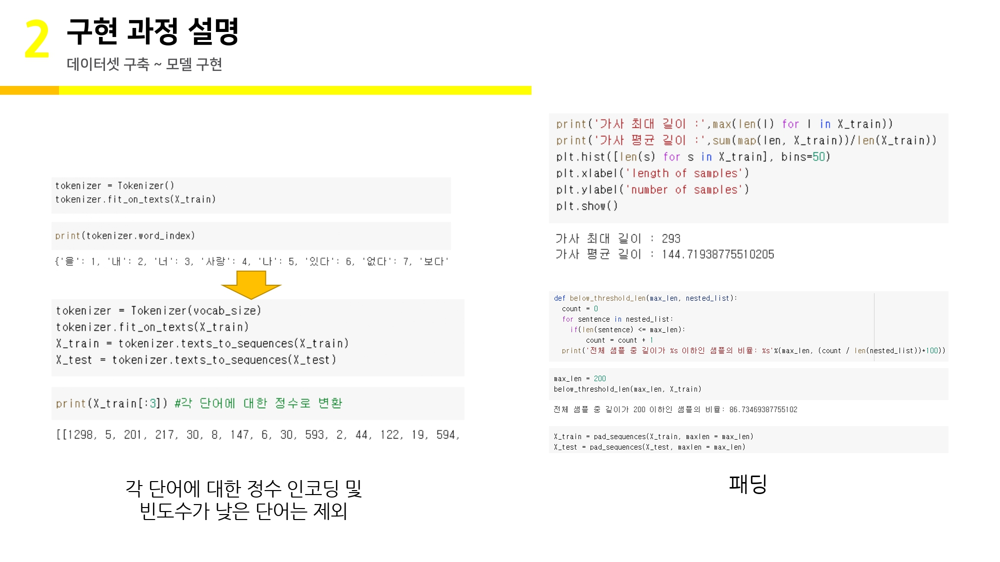  
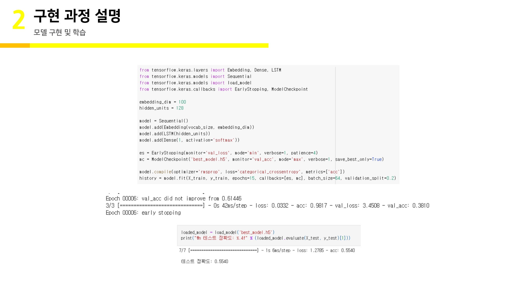  
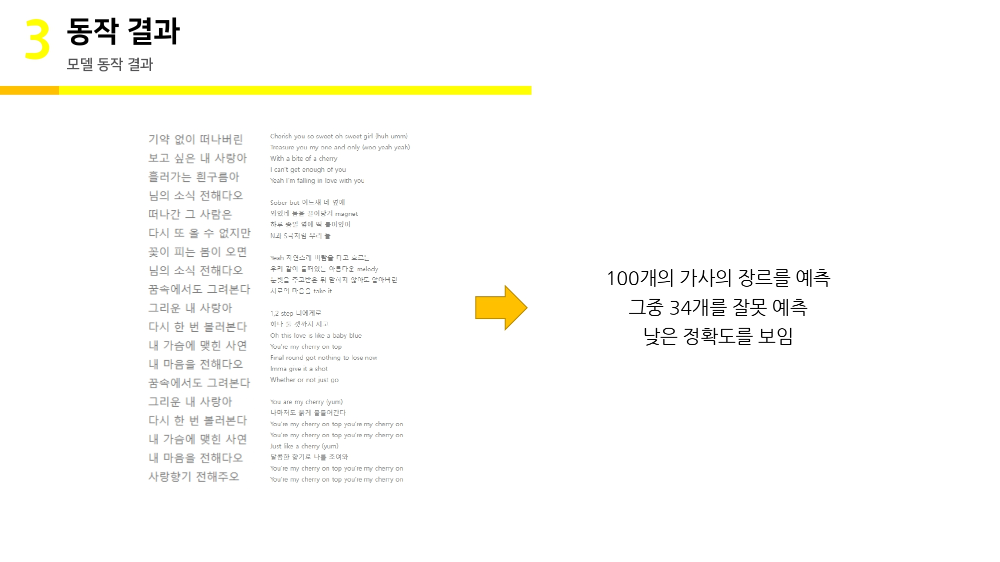  
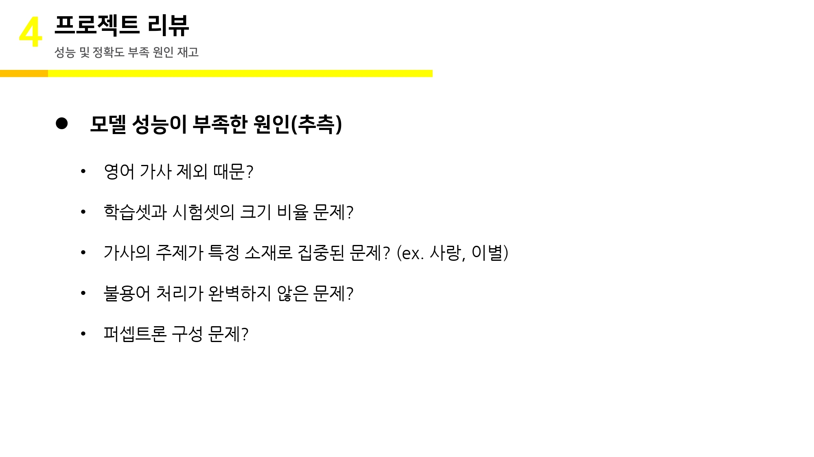  
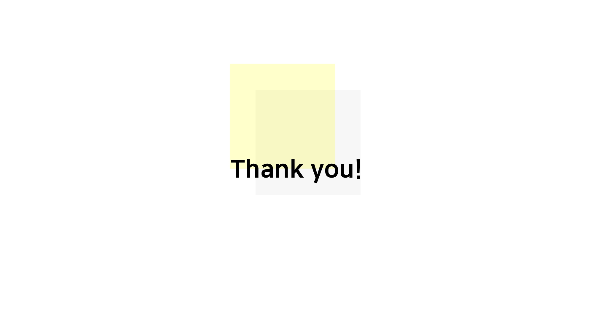  
